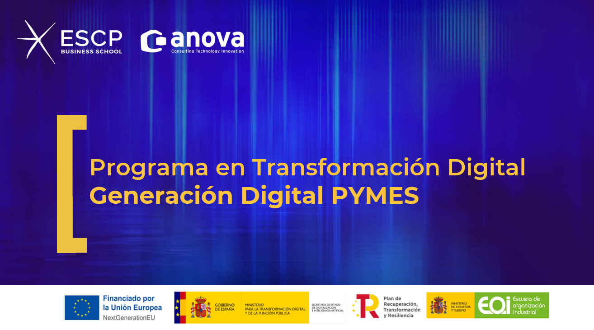

# Inteligencia artificial para PYMES

# Teoría y Recursos

## Módulo 1: IA y LLMs – Primeros pasos para una PYME inteligente
| Teoría                                                    | Contenido                                          |
| --------------------------------------------------------- | -------------------------------------------------- |
| [Clase1_1](./teoria/modulo1/clase1_1.md)                   | 1.1 Qué es la IA y cómo se aplica hoy en día                                       |
| [Clase1_2](./teoria/modulo1/clase1_2.md)                   | 1.2 Modelos de lenguaje: ChatGPT, Perplexity, Gemini |
| [Clase1_3_1](./teoria/modulo1/clase1_3_1.md)                   | Vídeos: 1.3 Casos prácticos I: redacción de emails, creación de documentos, resúmenes, traducción |
| [Clase1_3_2](./teoria/modulo1/clase1_3_2.md)                   | Ejemplos email: 1.3 Casos prácticos I: redacción de emails, creación de documentos, resúmenes, traducción |
| [Clase1_3_3](./teoria/modulo1/clase1_3_3.md)                   | Ejemplo resumen: 1.3 Casos prácticos I: redacción de emails, creación de documentos, resúmenes, traducción |
| [Clase1_4](./teoria/modulo1/clase1_4.md)                   | 1.4 Casos prácticos II: generación de ideas, creación de imágenes con DALL·E  |
| [Clase1_5](./teoria/modulo1/clase1_5.md)                   | 1.5 Sesión networking PYMEs |

## Módulo 2: IA en Marketing y Redes Sociales

| Teoría                                                    | Contenido                                          |
| --------------------------------------------------------- | -------------------------------------------------- |
| [Clase2_1_1](./teoria/modulo2/clase2_1_1.md)                   | 2.1 Creación de contenido para Marketing y Redes Sociales con ChatGPT y generación de imágenes con DALL·E                                      |
| [Clase2_1_2](./teoria/modulo2/clase2_1_2.md)                   | Envío de emails con diseño |
| [Clase2_1_3](./teoria/modulo2/clase2_1_3.md)                   | Ejercicios y vídeos |
| [Clase2_2_1](./teoria/modulo2/clase2_2_1.md)                   | 2.2 Herramientas para programar publicaciones                                      |
| [Clase2_2_2](./teoria/modulo2/clase2_2_2.md)                   | Ejercicio y vídeo |
| [Clase2_3_1](./teoria/modulo2/clase2_3_1.md)                   | 2.3 Análisis de resultados y optimización con IA |
| [Clase2_3_2](./teoria/modulo2/clase2_3_2.md)                   | Ejercicio y vídeo |
| [Clase2_4_1](./teoria/modulo2/clase2_4_1.md)                   | 2.4 Personalización de mensajes y segmentación de audiencias con IA  |
| [Clase2_4_2](./teoria/modulo2/clase2_4_2.md)                   | Ejemplo y vídeos |
| [Clase2_5_1](./teoria/modulo2/clase2_5_1.md)                   | 2.5 Uso responsable de la IA en contenidos y redes sociales                                      |
| [Clase2_6_1](./teoria/modulo2/clase2_6_1.md)                   | 2.6 La IA en marketing digital. Presentaciones de alto impacto |

## Módulo 3: Propuestas comerciales personalizadas

| Teoría                                                    | Contenido                                          |
| --------------------------------------------------------- | -------------------------------------------------- |
| [Clase3_1_1](./teoria/modulo3/clase3_1_1.md)                   | 3.1 Generación de propuestas y presupuestos con ChatGPT y otras IA  |
| [Clase3_2_1](./teoria/modulo3/clase3_2_1.md)                   | 3.2 Redacción de descripciones comerciales e emails personalizados.  |
| [Clase3_2_2](./teoria/modulo3/clase3_2_2.md)                   | Ejercicio y vídeos  |
| [Clase3_3_1](./teoria/modulo3/clase3_3_1.md)                   | 3.3: Plantillas Inteligentes y Refinamiento Comercial  |
| [Clase3_3_2](./teoria/modulo3/clase3_3_2.md)                   | Ejercicios  |
| [Clase3_4_1](./teoria/modulo3/clase3_4_1.md)                   | 3.4: Ajuste y Reutilización de Propuestas |
| [Clase3_5_1](./teoria/modulo3/clase3_5_1.md)                   | 3.5 Privacidad y tratamiento de datos en contenidos personalizados  |
| [Clase3_5_2](./teoria/modulo3/clase3_5_2.md)                   | Ejemplos y herramientas  |

## Módulo 4: 4. IA en Atención al Cliente y Ventas

| Teoría                                                    | Contenido                                          |
| --------------------------------------------------------- | -------------------------------------------------- | 
| [Clase4_1_1](./teoria/modulo4/clase4_1_1.md)                   | 4.1 Análisis de sentimiento con ChatGPT y Perplexity  |
| [Clase4_1_2](./teoria/modulo4/clase4_1_2.md)                   | Ejemplos prácticos  |
| [Clase4_1_3](./teoria/modulo4/clase4_1_3.md)                   | Ejemplo en Python  |
